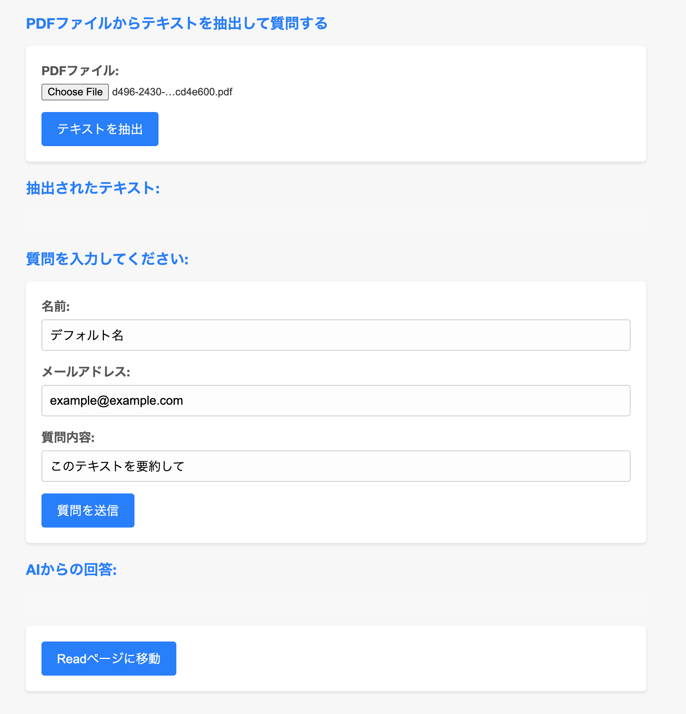

# ①課題番号-プロダクト名

アンケートフォーム兼即時回答QAサイト

## ②課題内容（どんな作品か）
- ユーザが添付したPDFファイルからテキストを抽出し、その内容に基づいて質問を送ると即時AIから回答が得られるサイト
- 本来は企業側が事前に自社サービスの内容をAIに読み込ませておくような動作を想定
- 制約事項
  - Chromeのbeta機能を利用しているため動作には環境設定が必要
  - gemini nanoの制約で長いPDFファイルは読み込めません
  - 精度もまあまあなので実用性はそこまでありません
    - 実際の有料版API利用する方式に変更すれば精度高くなるはず

## ③DEMO
- 以下画像をクリックすると動画で確認できます。
  - 現時点では一部Chromeベータ版の機能を使っているため、利用方法については⑦参照
  - 動画はChrome Version 130.0.6669.2 (Official Build) dev (arm64)で動作
-  

## ④作ったアプリケーション用のIDまたはPasswordがある場合
なし
<!-- - ID：dev@challenge-project.com
- PW：zK2n*N_m -->

## ⑤工夫した点・こだわった点
- 企業で必要になりそうな体験を想像しながら作成物を決めたところ
- PDFファイルを保存できるようにしたこと

## ⑥難しかった点・次回トライしたいこと(又は機能)
- 難しかった点
    - エスケープ処理しないと色々表示が崩れるのが難しかった（まだバグ残ってそう）
- 次回トライしたいこと
  - 課題だと費用がかからずAPIの管理も不要なローカルLLMを利用したが、機能が少ないので有料版にしつつ、高機能高精度にしたい。
    - PDFからテキストを抽出して返答していたが、もう少しイラスト等も含めた形で回答できるようにしたい
    - 長いPDFやテキストについても扱えるようにしたい
    - Chrome拡張機能を使ってそれぞれの人に有料APIキーを入力してもらって実行とかできるとよいかも？

## ⑦質問・疑問・感想、シェアしたいこと等なんでも
- [感想]
  - ファイル処理やエスケープ処理が難しくて、phpを使うことで処理が一気に複雑になったように感じた。対策しきれなかったので脆弱なサイトを作ってしまった気がする。。
- [参考記事]
  - AI on Chromeドキュメント
    - https://developer.chrome.com/docs/ai/built-in?hl=ja#get_an_early_preview
  - PromptAPI利用方法
    - https://github.com/explainers-by-googlers/prompt-api/tree/main
  - 【AI】Chromeに組み込まれたGemini Nanoを使ってみる（ちょっと古いがchromeの設定方法の参考に）
    - https://qiita.com/pitao/items/f1355b8002e360f83c93